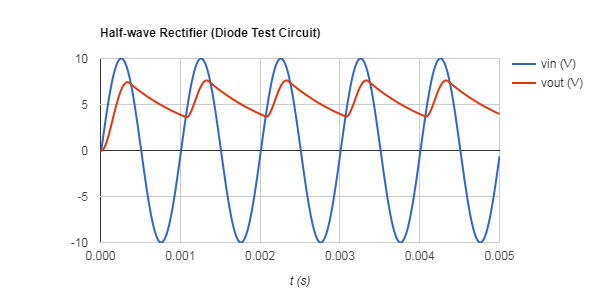

# ELCT 350 Code Library (UofSC EE Dept)

## Example Usage of Simulator and Plotter

```cpp
#include "Matrix.hpp"
#include "Plotter.hpp"
#include "Simulator.hpp"

#include "VoltageSource.hpp"
#include "Resistor.hpp"
#include "Capacitor.hpp"
#include "Diode.hpp"

/*

Half-Wave Rectifier Circuit Example:
                  
     1       D1   2     R1    3
     .------->|--------[ ]----.-------.
    +|   +                    |       |    +
 V1 (~)  vin              R2 [ ]  C1 ===  vout
     |   -                    |       |    -
     '------------------------'-------'
                             ---  0
                              '
*/

int main()
{
    int nodes = 3; // non-ground, external nodes
    
    Simulator simulator(nodes);
    
    VoltageSource V1(0, 1, 0.0, 10.0, 1.0e3); // ac voltage source
    Diode D1(1, 2);
    Resistor R1(2, 3, 1.0);
    Resistor R2(3, 0, 10.0);
    Capacitor C1(3, 0, 100.0e-6);
    
    simulator.Add(V1);
    simulator.Add(D1);
    simulator.Add(R1);
    simulator.Add(R2);
    simulator.Add(C1);
    
    simulator.Init(10e-6, 5e-3); // (dt, tmax)
    
    Plotter plotter("Half-wave Rectifier (Diode Test Circuit)");
    plotter.SetLabels("vin (V)", "vout (V)");
    
    // simulation loop:
    
    while(simulator.IsRunning())
    {
        plotter.AddRow(simulator.GetTime(), V1.GetVoltage(), R2.GetVoltage());
        simulator.Step();
    }
    
    plotter.Plot();
}
```

## Output



